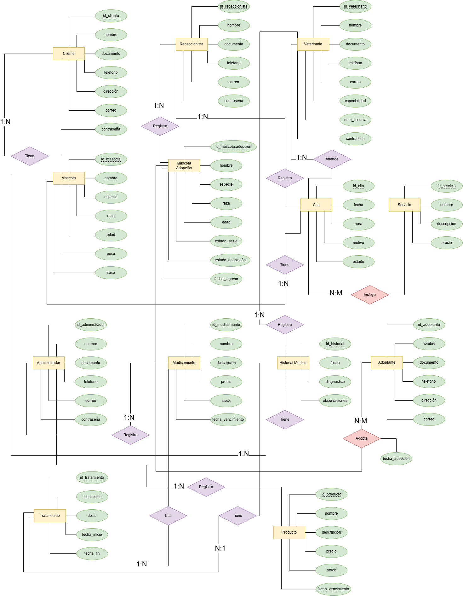

<div align="center">


# Veterinaria Ternurines
### Sistema de Gestión de Clínica Veterinaria

[](https://www.postgresql.org/)
[](https://www.java.com/)
[](https://spring.io/projects/spring-boot)
[](https://www.docker.com/)
[](https://www.udistrital.edu.co/)

*Proyecto Final — Bases de Datos*

</div>

---

## Descripción

**Veterinaria Ternurines** es un sistema de gestión integral para clínicas veterinarias que centraliza en una base de datos relacional toda la información operativa del negocio. El sistema permite administrar clientes, mascotas, citas médicas, historiales clínicos, tratamientos, inventario de medicamentos y el proceso de adopción de animales rescatados. Está diseñado para ser utilizado por cuatro perfiles de usuario: **administrador**, **veterinario**, **recepcionista** y **cliente**, cada uno con acceso controlado según su rol.

---

## Integrantes

| # | Nombre | Código | Correo institucional |
|---|--------|--------|----------------------|
| 1 | Andrés Felipe García Vargas | 20231020176 | afgarciav@udistrital.edu.co |
| 2 | Carol Stefanya Velasco Rodríguez | 20231020215 | csvelascor@udistrital.edu.co |
| 3 | Marlon Yecid Riveros Guio | 20231020208 | myriverosg@udistrital.edu.co |
| 4 | Samuel Eduardo Delgadillo Sepúlveda | 20231020218 | sedelgadillos@udistrital.edu.co |

---

## Requisitos previos

| Herramienta | Versión | Descarga |
|-------------|---------|---------|
| Java (JDK) | **21** | [adoptium.net](https://adoptium.net/) |
| Docker Desktop | Última estable | [docker.com](https://www.docker.com/products/docker-desktop/) |
| VS Code o IntelliJ IDEA | Última estable | [code.visualstudio.com](https://code.visualstudio.com/) / [jetbrains.com](https://www.jetbrains.com/idea/) |
| Git | Cualquiera | [git-scm.com](https://git-scm.com/) |

---

## Instalación (con Docker — recomendado)

Esta es la forma más rápida de levantar el proyecto sin instalar PostgreSQL manualmente.

### 1. Clonar el repositorio

```bash
git clone https://github.com/tefaa11/Proyecto-Bases-de-Datos.git
cd veterinaria-ternurines
```

### 2. Levantar la base de datos con Docker

```bash
docker run --name ternurines-db \
  -e POSTGRES_DB=veterinaria_ternurines \
  -e POSTGRES_USER=ternurines \
  -e POSTGRES_PASSWORD=ternurines123 \
  -p 5432:5432 \
  -d postgres:16
```

Espera unos segundos a que el contenedor inicie y luego carga el script SQL:

```bash
docker exec -i ternurines-db psql -U ternurines -d veterinaria_ternurines < database/schema.sql
```

### 3. Configurar `application.properties`

Edita `src/main/resources/application.properties` con los datos del contenedor:

```properties
spring.application.name=ternurines

spring.datasource.url=jdbc:postgresql://localhost:5432/veterinaria_ternurines
spring.datasource.username=ternurines
spring.datasource.password=ternurines123
spring.datasource.driver-class-name=org.postgresql.Driver
```

### 4. Ejecutar la aplicación

```bash
./mvnw spring-boot:run
```

> En Windows usa `mvnw.cmd spring-boot:run`

La aplicación quedará disponible en: `http://localhost:8080`

---

## Instalación sin Docker (opcional)

Si prefieres instalar PostgreSQL directamente en tu máquina:

<details>
<summary>Ver instrucciones</summary>

1. Instala [PostgreSQL 14+](https://www.postgresql.org/download/)
2. Crea la base de datos:
   ```sql
   CREATE DATABASE veterinaria_ternurines;
   ```
3. Carga el script:
   ```bash
   psql -U postgres -d veterinaria_ternurines -f database/schema.sql
   ```
4. Configura `application.properties` con tu usuario y contraseña de PostgreSQL local.
5. Ejecuta con `./mvnw spring-boot:run`

</details>

---

## Diagrama Entidad-Relación

> Modelo de base de datos con las entidades del sistema, sus relaciones y cardinalidades.



**Entidades:** `cliente` · `veterinario` · `recepcionista` · `administrador` · `mascota` · `cita` · `servicio` · `historial_medico` · `tratamiento` · `medicamento` · `producto` · `adoptante` · `mascota_adopcion` 

---

## Endpoints

>  **En construcción** — Se documentarán una vez implementada la capa REST.

| Método | URL | Descripción | Rol requerido |
|--------|-----|-------------|---------------|
| — | — | *Próximamente* | — |

<!--
Ejemplo de cómo completar esta tabla cuando estén listos:
| GET    | /api/clientes              | Lista todos los clientes              | ADMIN, RECEPCIONISTA |
| POST   | /api/clientes              | Registra un nuevo cliente             | RECEPCIONISTA        |
| GET    | /api/mascotas/{id}         | Consulta información de una mascota   | Todos                |
| POST   | /api/citas                 | Agenda una nueva cita médica          | RECEPCIONISTA        |
| GET    | /api/historial/{idMascota} | Historial clínico de una mascota      | VET, CLIENTE         |
-->

---

## Requerimientos funcionales implementados

> **En construcción** — Se actualizará al completar cada módulo.

- [ ] *Funcionalidad 1 — por definir*
- [ ] *Funcionalidad 2 — por definir*
- [ ] *Funcionalidad 3 — por definir*
- [ ] *Funcionalidad 4 — por definir*

---

## Stack tecnológico

| Capa | Tecnología |
|------|-----------|
| Backend | Java 21 + Spring Boot 4.0.6 |
| Acceso a datos | Spring JDBC (`spring-boot-starter-jdbc`) |
| Base de datos | PostgreSQL 14+ |
| Servidor web | Spring MVC (`spring-boot-starter-webmvc`) |
| Build | Maven Wrapper |
| BD en local | Docker |

---

<div align="center">

**Universidad Distrital Francisco José de Caldas** · Facultad de Ingeniería  
Bases de Datos · 2026

</div>
